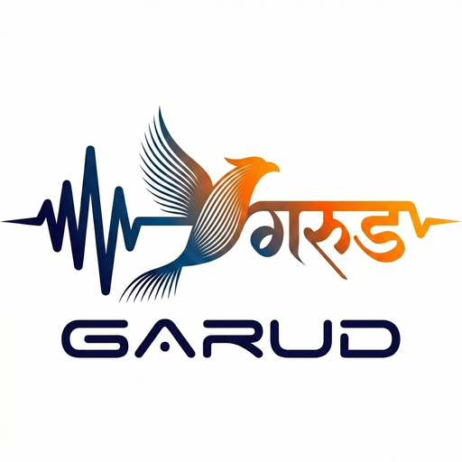

# Garud for Real-Time English → Hindi Speech-to-Speech Translation

<p align="center">
  
</p>

**On-device, CPU-only, fully offline** translation from spoken English to spoken Hindi. Runs on **ARM Android** (arm64-v8a, NEON) and **x86/Linux** (host build for development). No cloud; no Python at runtime. Pure C++17.

Built for the **Bharat AI-SoC Student Challenge 2026**.

---

## Features

- **Fully offline** — zero network dependency, all inference on-device
- **Real-time pipeline** — three threads (ASR → MT → TTS) connected by lock-free SPSC queues
- **Two translation modes** switchable at runtime:
  - **Speed** — Marian NMT only (~49ms, correct Hindi)
  - **Balanced** — NMT draft + LLM single-pass validation (~300–600ms)
- **NMT-accelerated speculative decoding** — Marian NMT drafts Hindi, Qwen3-0.6B (ExecuTorch) verifies with 65% token acceptance via refinement prompt
- **Sentence-wise translation** — ASR accumulates text, pipeline detects sentence boundaries (`.?!`), translates each sentence exactly once
- **Echo suppression** — mic muted during TTS playback (+1000ms buffer), ASR audio buffer flushed after suppression to prevent feedback loops
- **Upgraded ASR** — whisper base.en (142 MB) for ~30% lower WER than tiny.en
- **Native Devanagari phonemizer** — 110-entry IPA table, no Python subprocess
- **~4,200 lines** of custom C++ (excluding third-party libraries)

---

## What This Project Does

1. **Captures** English speech (microphone or WAV file).
2. **Transcribes** it with **whisper.cpp** (base.en, ggml, streaming, 3-second chunks).
3. **Translates** to Hindi with **Marian NMT** (encoder–decoder ONNX, INT8, SentencePiece) or **Qwen3-0.6B** (ExecuTorch, INT4) for validation.
4. **Synthesizes** Hindi speech with **Piper VITS** (ONNX, Devanagari→IPA, pad interspersing).
5. **Plays** the result (speaker or WAV file) with echo suppression.

**Target:** < 500 ms time-to-first-audio in Speed mode; sentence-level streaming to keep latency low.

---

## Architecture

```
┌──────────────────────────────────────────────────────────────────┐
│                    Garud Translation Pipeline                    │
│                                                                  │
│  Microphone (16 kHz PCM)                                         │
│       │                                                          │
│       ▼                                                          │
│  ┌──────────┐  Lock-free   ┌──────────────┐  Lock-free           │
│  │ Thread 1 │  SPSC Queue  │   Thread 2   │  SPSC Queue          │
│  │   ASR    │ ───────────► │  Translation │ ───────────►         │
│  │whisper   │ English text │  MT Wrapper  │ Hindi text           │
│  │(base.en) │              │   2 modes    │                      │
│  └──────────┘              └──────┬───────┘                      │
│                              ┌────┴────┐                         │
│                         ┌────┤  Mode?  ├────┐                    │
│                         │    └─────────┘    │                    │
│                         ▼                   ▼                    │
│                    ┌────────┐          ┌─────────┐               │
│                    │ SPEED  │          │BALANCED │               │
│                    │  NMT   │          │NMT+LLM │                │
│                    │ ~49ms  │          │~300-    │               │
│                    │        │          │ 600ms   │               │
│                    └────────┘          └─────────┘               │
│                                                                  │
│  ┌──────────┐  Lock-free                                         │
│  │ Thread 3 │ ◄─────────── Hindi text                            │
│  │   TTS    │                                                    │
│  │Piper VITS│ ───────────► Speaker (16 kHz PCM)                  │
│  └──────────┘  Lock-free                                         │
│                SPSC Queue                                        │
│                                                                  │
│  ┌──────────────────────────────────────────────────────────┐    │
│  │  Echo Suppression: Mic muted during TTS + 1000ms buffer  │    │
│  │  ASR audio buffer flushed when suppression ends          │    │
│  └──────────────────────────────────────────────────────────┘    │
└──────────────────────────────────────────────────────────────────┘
```

- **Lock-free SPSC queues**: Power-of-2 capacity, 64-byte cache-line aligned atomics, `acquire`/`release` memory ordering to prevent false sharing
- **Sentence detection**: ASR accumulates `confirmed_text_`, pipeline scans for `. ? !`, sends each sentence to MT exactly once via `last_translated_pos_` tracking
- **Echo suppression**: Two-layer — timestamp-based mic muting + ASR buffer flush when suppression ends (prevents whisper from processing stale TTS-contaminated audio)

See [docs/ARCHITECTURE.md](docs/ARCHITECTURE.md) for detailed component documentation.

---

## Speculative Decoding

Garud implements **NMT-accelerated speculative decoding** — a novel approach where:

1. **Marian NMT** (encoder-decoder) generates a Hindi draft in ~49ms
2. **Qwen3-0.6B** (decoder-only LLM, ExecuTorch) verifies the draft

The key insight is the **refinement prompt**: instead of asking the LLM to translate from scratch (which yields only 4% token acceptance because the 0.6B model produces incorrect Hindi independently), we give the LLM the NMT draft as context. The LLM then echoes correct tokens and only diverges where it has a genuine correction, achieving **65% acceptance**.

| Approach | Acceptance | Hindi Quality |
|----------|-----------|---------------|
| Naive (LLM translates from scratch) | 4% | Incorrect |
| **Refinement prompt (LLM refines NMT draft)** | **65%** | Correct with minor corrections |

Two verification strategies:
- **Single-pass validation** (Balanced mode): One LLM forward pass over prompt + draft → confidence score. Always returns NMT output. Fast (~300-600ms).
- **KV-cache speculative decode** (backend): Prefill once, verify draft tokens incrementally with KV-cache reuse. O(n) instead of O(n²).

See [docs/REPORT.md](docs/REPORT.md) for the full technical report.

---

## Repository Layout

```
garud/
├── asr/              # ASR: whisper.cpp wrapper (submodule: asr/whisper_cpp)
├── mt/               # MT: Marian ONNX + SentencePiece + LLM (ExecuTorch)
│   ├── llm_translator.h/cpp    # Speculative decoding, validation, KV-cache
│   ├── marian_mt_wrapper.h/cpp # ONNX Runtime + SentencePiece
│   ├── mt_wrapper.h/cpp        # Two-mode routing layer
│   └── translation_mode.h      # SPEED/BALANCED enum
├── tts/              # TTS: Piper VITS ONNX + Devanagari→IPA phonemizer
├── pipeline/         # Orchestrator, lock-free SPSC queues, echo suppression
├── host/             # Host (desktop) CLI app — PortAudio or file I/O
├── android/          # Android app: JNI, Gradle, UI
│   ├── app/src/main/java/      # MainActivity, NativePipeline, ModelManager
│   └── native-lib/             # JNI bridge (11 native methods)
├── models/           # Model configs & tokenizers (weights downloaded separately)
├── scripts/          # Build, model download, quantization, Android prep
├── utils/            # environment.yml (Conda env for model prep)
├── third_party/      # SentencePiece (for Android build)
├── releases/         # Saved APK builds
└── docs/             # ARCHITECTURE.md, REPORT.md, TODO.md
```

**Models (not in repo):** ASR ~142 MB, MT ~534 MB INT8, TTS ~60 MB, LLM ~388 MB INT4. Download via `scripts/`.

---

## Requirements

| Context | Requirements |
|--------|---------------|
| **Host build** | CMake ≥3.18, C++17, ONNX Runtime C++, SentencePiece; optional PortAudio, ExecuTorch |
| **Android build** | Android SDK 34, NDK r25+, CMake 3.22; run `scripts/setup_android_deps.sh` for ONNX Runtime + SentencePiece |
| **Android device** | arm64-v8a, Android 8+, 4–6 GB RAM, ~600 MB free storage, microphone permission |
| **Model prep** | Conda env `deer-arm` (Python 3.10 + torch + transformers + ExecuTorch) for download/export |

---

## Quick Start (Host)

```bash
git clone <repo-url> garud && cd garud
git submodule update --init --recursive

# Conda env (model download/quantization)
conda env create -f utils/environment.yml
conda activate deer-arm

# Download models
./scripts/download_asr_model.sh
./scripts/download_mt_model.sh
./scripts/download_tts_model.sh

# Download + export LLM model (optional, for Balanced mode)
./scripts/download_llm_model.sh
./scripts/export_llm_model.sh

# Quantize MT models (optional for host, required for mobile)
pip install onnxruntime
python -c "
from onnxruntime.quantization import quantize_dynamic, QuantType
base = 'models/mt/onnx'
for name in ['encoder_model', 'decoder_model', 'decoder_with_past_model']:
    quantize_dynamic(base + f'/{name}.onnx', base + f'/{name}_int8.onnx', weight_type=QuantType.QInt8)
"

# Build host binary
./scripts/build_host.sh

# Run — Speed mode (NMT only)
./build-host/translation_host \
  --asr-model models/asr/ggml-base.en.bin \
  --mt-model models/mt/onnx/encoder_model.onnx \
  --tts-model models/tts/hi_IN-rohan-medium.onnx \
  --input your_audio.wav --output hindi.wav

# Run — Balanced mode (NMT + LLM validation)
./build-host/translation_host \
  --asr-model models/asr/ggml-base.en.bin \
  --mt-model models/mt/onnx/encoder_model.onnx \
  --tts-model models/tts/hi_IN-rohan-medium.onnx \
  --llm-model models/llm/qwen3_0.6B.pte \
  --llm-tokenizer models/llm/Qwen3-0.6B/tokenizer.json \
  --translation-mode balanced \
  --input your_audio.wav --output hindi.wav

# Translation modes: speed | balanced
#   speed    — NMT only (~49ms, correct Hindi)
#   balanced — NMT draft + single-pass LLM validation (~300-600ms)
```

---

## Android Build & Deploy

```bash
# 1. Android deps (ONNX Runtime + SentencePiece for arm64-v8a)
./scripts/setup_android_deps.sh

# 2. Prepare models (INT8) and copy into app assets
./scripts/prepare_models_android.sh

# 3. Build APK
cd android && ./gradlew assembleDebug

# 4. Install on device
adb install app/build/outputs/apk/debug/app-debug.apk

# 5. (Optional) Push LLM for Balanced mode
adb push models/llm/qwen3_0.6B.pte /sdcard/Android/data/com.armm.translation/files/models/llm/
```

Open the app → allow microphone → wait for "Ready" (first run extracts models from APK, ~30s) → select translation mode → tap **Start** and speak English.

---

## Model Sizes

| Component | Size | Format | Quantization |
|-----------|------|--------|-------------|
| ASR (ggml-base.en.bin) | 142 MB | ggml | FP16 |
| MT encoder | 194 MB | ONNX | INT8 |
| MT decoder | 340 MB | ONNX | INT8 |
| MT tokenizers (spm + vocab.json) | ~3 MB | — | — |
| TTS (Piper Hindi VITS) | 60 MB | ONNX | FP32 |
| LLM (Qwen3-0.6B) | 388 MB | .pte | INT4 (8da4w) |
| **Total in APK (NMT only)** | **~618 MB** | | |
| **Total with LLM** | **~1.0 GB** | | |

Peak RAM: ~765 MB. Suitable for phones with 4–6 GB RAM.

---

## Performance

| Pipeline Stage | Speed Mode | Balanced Mode |
|---------------|------------|---------------|
| ASR (whisper base.en) | ~1.8s / 3s chunk | ~1.8s / 3s chunk |
| NMT translation | 49ms | 49ms |
| LLM validation | — | ~300-600ms |
| TTS synthesis | 150ms | 150ms |
| **Translation latency** | **49ms** | **~300-600ms** |
| **Acceptance rate** | N/A | **65%** |

Tested on **OnePlus CPH2767** (Android 16, Snapdragon arm64-v8a). All features verified working: NMT translation, LLM validation, TTS output, echo suppression, sentence-wise translation, and live mode switching.

---

## Tech Stack

| Component | Choice | Rationale |
|-----------|--------|-----------|
| ASR | whisper.cpp (base.en) | C++, NEON-friendly, ~5.2% WER, 30% better than tiny.en |
| MT (NMT) | Marian NMT (ONNX) | Fast draft for speculative decoding; INT8, ~49ms |
| MT (LLM) | Qwen3-0.6B (ExecuTorch) | LLM verification via XNNPACK + KleidiAI; INT4 |
| Speculative decoding | NMT draft + LLM verify | Cross-architecture: encoder-decoder drafts for decoder-only LLM |
| TTS | Piper VITS (ONNX) | Single-stage, native Hindi phonemizer; no Python |
| LLM Runtime | ExecuTorch 1.1.0 (C++) | XNNPACK + KleidiAI for SME2/NEON on ARM |
| Inference Runtime | ONNX Runtime 1.22.0 (C++) | Single stack for NMT + TTS on Android |
| Tokenization | SentencePiece (C++) | Matches Marian; statically linked on Android |
| Concurrency | Lock-free SPSC queues | 64-byte aligned atomics, avoids mutex latency spikes |

---

## Android App

The Android app provides:
- **Mode switcher** — Speed / Balanced radio buttons for runtime mode selection
- **Loading spinner** — visible during model extraction (~30s) and pipeline initialization
- **Live transcription** — English (ASR) and Hindi (Translation) text areas update in real-time (200ms refresh)
- **Background init** — pipeline initialization on background thread to keep UI responsive
- **Custom Garud icon** — Garuda bird logo

Build config: SDK 34, minSdk 26, NDK 25.2, arm64-v8a + x86_64, ExecuTorch AAR 0.7.0, ONNX Runtime 1.22.0.

---

## License & Third-Party

| Library | License |
|---------|---------|
| whisper.cpp | MIT |
| ONNX Runtime | MIT |
| ExecuTorch | BSD |
| SentencePiece | Apache 2.0 |
| Piper / OPUS-MT models | MIT / CC-BY-4.0 |

---

## Troubleshooting

| Issue | Fix |
|-------|-----|
| `whisper.cpp not found` | `git submodule update --init --recursive` |
| ONNX Runtime / SentencePiece not found (host) | `conda install onnxruntime-cpp sentencepiece -c conda-forge` |
| Android build fails (CMake / NDK) | Check `android/local.properties`, NDK path; run `scripts/setup_android_build.sh` |
| App OOM on device | Ensure INT8 models; run `prepare_models_android.sh` |
| No sound / placeholder text | Check model paths and RECORD_AUDIO permission |
| LLM not loading | `adb push models/llm/qwen3_0.6B.pte` to device storage |
| OnePlus no logcat output | Use file-based logging — check `pipeline.log` on device |
| Model extraction slow on first launch | Normal — ~30s to extract 618 MB from APK. Wait for "Ready" status. |

For more detail, see [docs/BUILD.md](docs/BUILD.md) and [docs/ARCHITECTURE.md](docs/ARCHITECTURE.md).

---

## Documentation

- [docs/REPORT.md](docs/REPORT.md) — Full technical report (speculative decoding, benchmarks, architecture)
- [docs/ARCHITECTURE.md](docs/ARCHITECTURE.md) — Detailed component documentation
- [docs/TODO.md](docs/TODO.md) — Development roadmap and completed items
